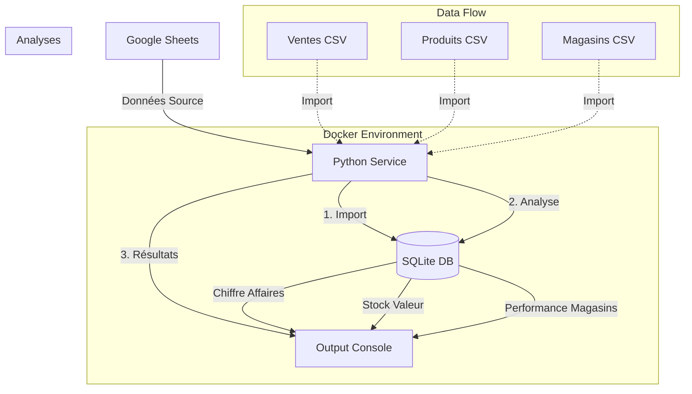
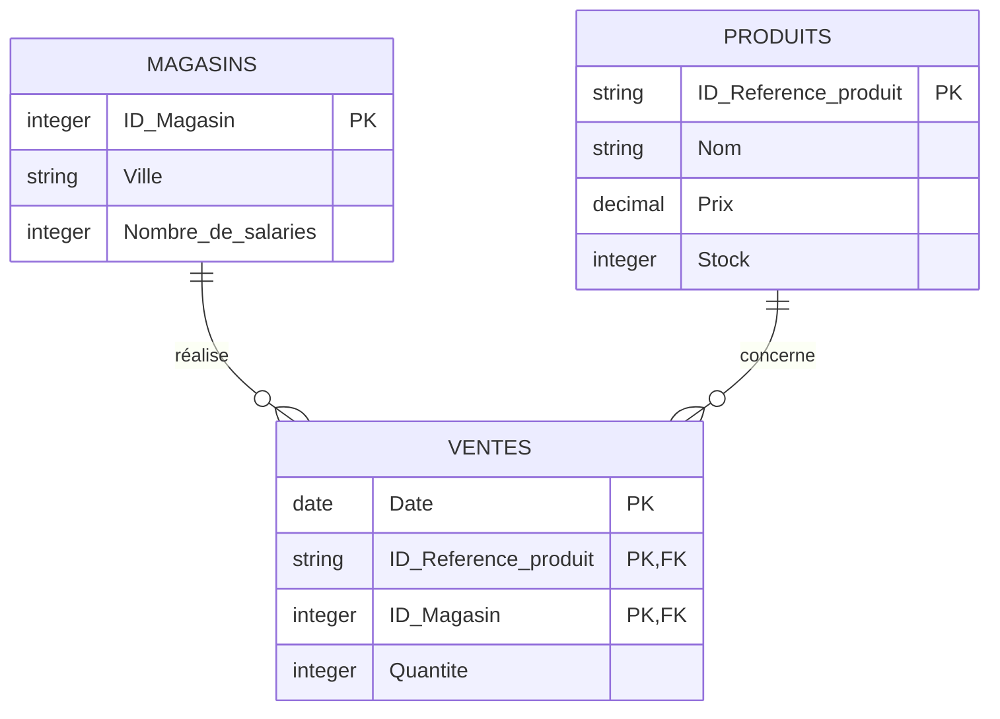

# Projet simplon

Ce projet implémente une solution d'analyse de données de ventes pour une PME, utilisant une architecture à deux services Docker pour le traitement et le stockage des données.

## 🏗 Architecture

Le projet utilise une architecture à deux services avec un flux de données complet :



Le système est composé de :
- **Service Python** : Conteneur exécutant les scripts d'import et d'analyse
- **Service SQLite** : Base de données stockant et servant les données
- **Flux de Données** : Pipeline automatisé depuis Google Sheets jusqu'aux analyses

## 📁 Structure du projet

```
.
├── docker-compose.yml
├── scripts/
│   ├── Dockerfile
│   ├── requirements.txt
│   ├── main.py
├── data/
│   ├── analysis.db
└── README.md
```

## 🗃 Structure des données

Le modèle de données suit une structure relationnelle avec trois tables principales :



Caractéristiques principales :
- Table **VENTES** avec clé primaire composite (Date, ID_Reference_produit, ID_Magasin)
- Relations one-to-many entre MAGASINS/PRODUITS et VENTES
- Gestion des stocks et prix dans PRODUITS
- Données géographiques et RH dans MAGASINS

## 🚀 Installation

1. Construire et démarrer les services :
```bash
docker-compose up --build
```

2. Interagir avec le docker SQlite
```bash
docker exec -it sqlite_service sqlite3 /db/analysis.db
```

## 📊 Fonctionnalités

### Import des données
- Import automatique des liens google sheets
- Gestion des doublons
- Validation des données

### Analyses disponibles
1. **Analyses temporelles**
   - Évolution des ventes quotidiennes
   - Tendances par période
   - Jours de forte/faible activité

2. **Analyses spatiales**
   - Performance par magasin
   - Distribution géographique des ventes
   - Corrélation taille équipe/performance

3. **Analyses produits**
   - Top des produits vendus
   - Rotation des stocks
   - Chiffre d'affaires par produit

## 🛠 Technologies utilisées

- Python 3.11
- SQLite3
- Docker & Docker Compose
- Pandas pour le traitement des données

## 📝 Utilisation

1. **Importer les données**
```bash
docker-compose exec scripts python import_data.py
```

2. **Lancer les analyses**
```bash
docker-compose exec scripts python analyze_data.py
```

## 🔍 Monitoring et maintenance

- Les logs sont disponibles via Docker
- Les résultats d'analyses sont stockés dans la table `analyses_resultats`
- Backups automatiques de la base de données
