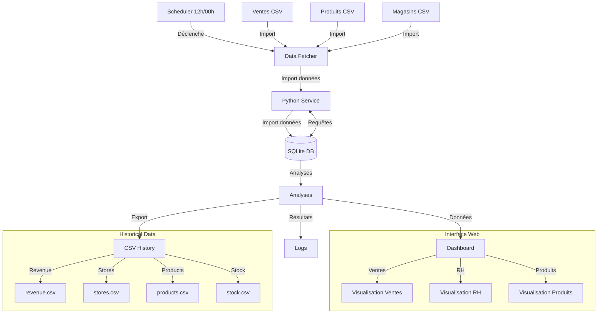
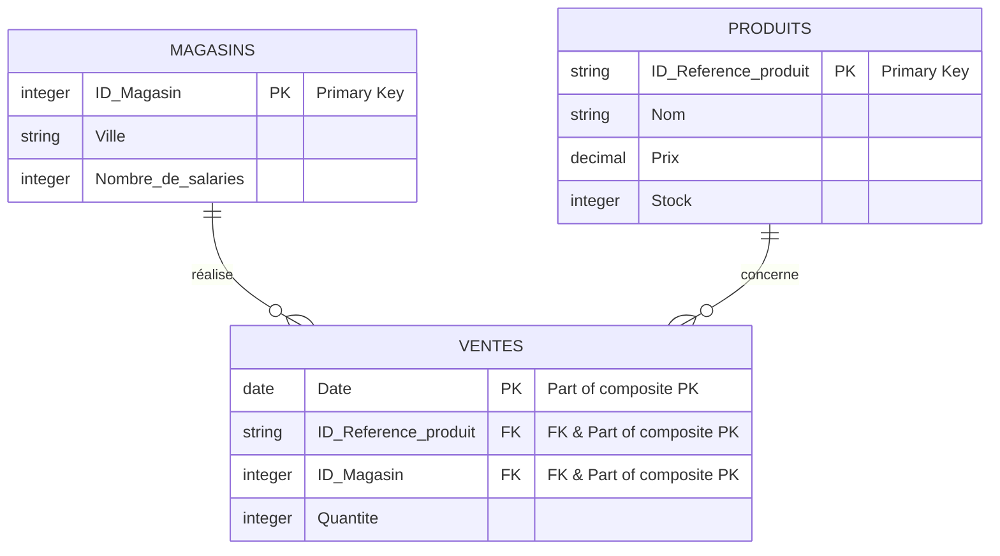

# Projet simplon

Ce projet implémente une solution d'analyse de données de ventes pour une PME, utilisant une architecture à deux services Docker pour le traitement et le stockage des données.

## 🏗 Architecture

Le projet utilise une architecture à deux services avec une configuration réseau et un flux de données complet :

### Configuration des Services

1. **Service Python (Analyse_des_resultats)**
    - Port: 5000 (réservé pour futures extensions API)
    - Port: 7860 (interface web Gradio)
    - Accès: Web interface accessible depuis l'extérieur
    - Communication: Bidirectionnelle avec SQLite via volumes Docker

2. **Service SQLite (sqlite_service)**
   - Port: Non exposé
   - Accès: Interne uniquement
   - Communication: Via volumes Docker partagés

### Flux de Données



Le système est composé de :
- **Service Python** : Conteneur exécutant les scripts d'import et d'analyse
- **Service SQLite** : Base de données stockant et servant les données
- **Flux de Données** : Pipeline automatisé depuis Google Sheets jusqu'aux analyses et exports CSV

## 📁 Structure du projet

```
.
├── docker-compose.yml
├── src/
│   ├── Dockerfile
│   ├── requirements.txt
│   ├── main.py
│   ├── web_app.py
│   ├── csv_exporter.py
│   ├── viz-config-ventes.json
│   ├── viz-config-magasins.json
│   ├── viz-config-produits.json
│   ├── logs/
│   │   └── data_fetcher.log
├── data/
│   └── analysis.db
├── historical_data/
│   ├── revenue_history/
│   │   └── revenue.csv
│   ├── store_history/
│   │   └── stores.csv
│   ├── product_history/
│   │   └── products.csv
│   └── stock_history/
│       └── stock.csv
└── README.md
```

Les fichiers de configuration viz-config-*.json contiennent les paramètres de visualisation pour chaque tableau de bord.

## 🗃 Structure des données

### Base de données SQLite

Le modèle de données suit une structure relationnelle avec trois tables principales :



### Fichiers CSV

Les données d'analyse sont exportées dans des fichiers CSV pour un suivi :

1. **revenue.csv**
   - timestamp
   - total_revenue
   - total_employees

2. **stores.csv**
   - timestamp
   - store_id
   - city
   - revenue
   - employee_count

3. **products.csv**
   - timestamp
   - product_name
   - units_sold
   - revenue

4. **stock.csv**
   - timestamp
   - total_units
   - total_value

Chaque fichier est mis à jour avec une nouvelle ligne à chaque analyse (à minuit), permettant un suivi des métriques clés.

## 🚀 Installation

1. Construire et démarrer les services :
```bash
docker-compose up --build
```

2. Interagir avec le docker SQlite
```bash
docker exec -it sqlite_service sqlite3 /db/analysis.db
```

## 📊 Fonctionnalités

### Import et export des données
- Import automatique et régulier des liens Google Sheets (12h et 00h heure de Paris)
- Export des analyses dans des fichiers CSV historiques
- Gestion des doublons
- Validation des données
- Logging détaillé des opérations

### Analyses disponibles
1. **Analyses temporelles**
   - Évolution des ventes quotidiennes
   - Tendances par période
   - Jours de forte/faible activité

2. **Analyses spatiales**
   - Performance par magasin
   - Distribution géographique des ventes
   - Corrélation taille équipe/performance

3. **Analyses produits**
   - Top des produits vendus
   - Rotation des stocks
   - Chiffre d'affaires par produit

## 🛠 Technologies utilisées

- Python 3.11
- SQLite3
- Docker & Docker Compose
- Pandas pour le traitement des données
- Schedule pour la planification des tâches
- Pytz pour la gestion des fuseaux horaires
- Gradio pour l'interface web interactive
- PyGWalker pour les visualisations de données

## 📊 Dashboard Web

Le projet inclut une interface web interactive accessible via Gradio qui propose trois sections principales :

### 1. Analyse des ventes 📈
- Visualisations détaillées des performances de vente
- Graphiques temporels et tendances
- Filtres interactifs pour l'analyse

### 2. RH & Magasins 👥
- Performances par magasin
- Analyse des effectifs
- Comparaisons et métriques clés

### 3. Catalogue produits 📦
- Vue d'ensemble du catalogue
- Statistiques de vente par produit
- Analyse des stocks

### Accès au dashboard
```bash
# Le dashboard est accessible sur le port 7860
http://localhost:7860
```

Caractéristiques :
- Interface intuitive avec onglets
- Visualisations interactives
- Filtres dynamiques
- Mise à jour automatique avec les dernières données

## 🔍 Monitoring et maintenance

- Les logs sont disponibles via Docker
- Logs détaillés dans `/app/logs/data_fetcher.log`
  * Imports automatiques à 12h et 00h (heure de Paris)
  * Statut des opérations d'import et d'export
  * Résultats des analyses
- Suivi historique dans `/app/historical_data/`
  * Évolution du chiffre d'affaires
  * Performance des magasins
  * Ventes des produits
  * État des stocks
- Backups automatiques de la base de données
- Surveillance des tâches programmées via les logs Docker
  ```bash
  docker logs -f Analyseur
  ```