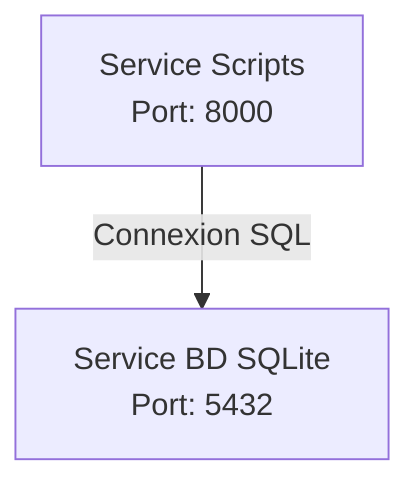

# Analyse des Ventes PME

Ce projet implémente une solution d'analyse de données de ventes pour une PME, utilisant une architecture à deux services Docker pour le traitement et le stockage des données.

## 🏗 Architecture

Le projet utilise une architecture à deux services :
bnb
- **Service Scripts** : Conteneur Python pour l'exécution des scripts d'import et d'analyse
- **Service Base de Données** : Conteneur SQLite pour le stockage et l'analyse des données



## 📁 Structure du Projet

```
.
├── docker-compose.yml
├── scripts/
│   ├── Dockerfile
│   ├── requirements.txt
│   ├── init_db.py
│   ├── import_data.py
│   └── analyze_data.py
├── data/
│   ├── fetch.py
└── README.md
```

## 🗃 Structure des Données

### Tables

1. **Magasins**
   - id_magasin (PK)
   - ville
   - nombre_salaries

2. **Produits**
   - id_reference (PK)
   - nom
   - prix
   - stock

3. **Ventes**
   - id (PK)
   - date_vente
   - id_reference (FK)
   - quantite
   - id_magasin (FK)

## 🚀 Installation

1. Construire et démarrer les services :
```bash
docker-compose up --build
```

## 📊 Fonctionnalités

### Import des Données
- Import automatique des liens google sheets
- Gestion des doublons
- Validation des données

### Analyses Disponibles
1. **Analyses Temporelles**
   - Évolution des ventes quotidiennes
   - Tendances par période
   - Jours de forte/faible activité

2. **Analyses Spatiales**
   - Performance par magasin
   - Distribution géographique des ventes
   - Corrélation taille équipe/performance

3. **Analyses Produits**
   - Top des produits vendus
   - Rotation des stocks
   - Chiffre d'affaires par produit

## 🛠 Technologies Utilisées

- Python 3.11
- SQLite3
- Docker & Docker Compose
- Pandas pour le traitement des données

## 📝 Utilisation

1. **Importer les données**
```bash
docker-compose exec scripts python import_data.py
```

2. **Lancer les analyses**
```bash
docker-compose exec scripts python analyze_data.py
```

## 🔍 Monitoring et Maintenance

- Les logs sont disponibles via Docker
- Les résultats d'analyses sont stockés dans la table `analyses_resultats`
- Backups automatiques de la base de données

## 🤝 Contribution

1. Fork le projet
2. Créer une branche (`git checkout -b feature/AmazingFeature`)
3. Commit les changements (`git commit -m 'Add some AmazingFeature'`)
4. Push vers la branche (`git push origin feature/AmazingFeature`)
5. Ouvrir une Pull Request

## 📄 Licence

Ce projet est sous licence MIT. Voir le fichier `LICENSE` pour plus de détails.