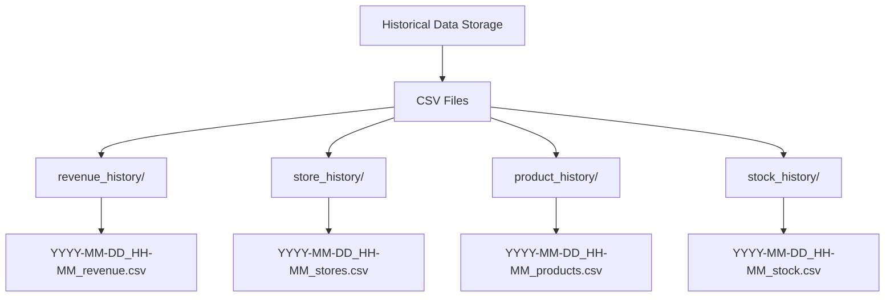
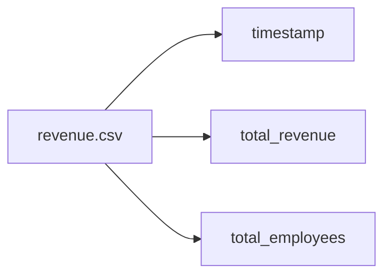
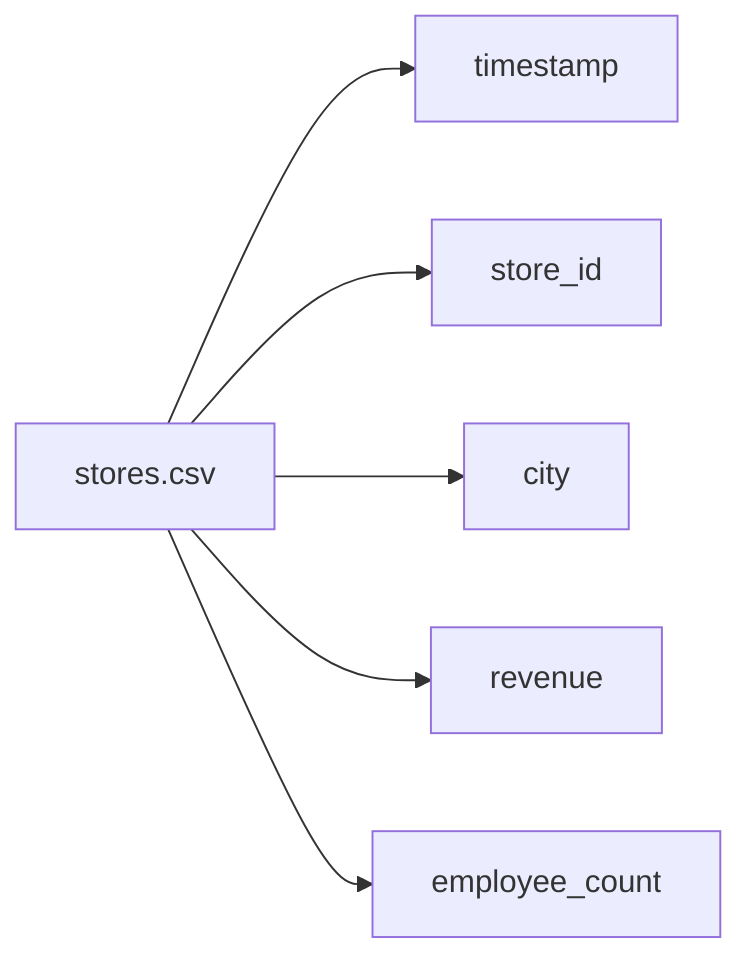
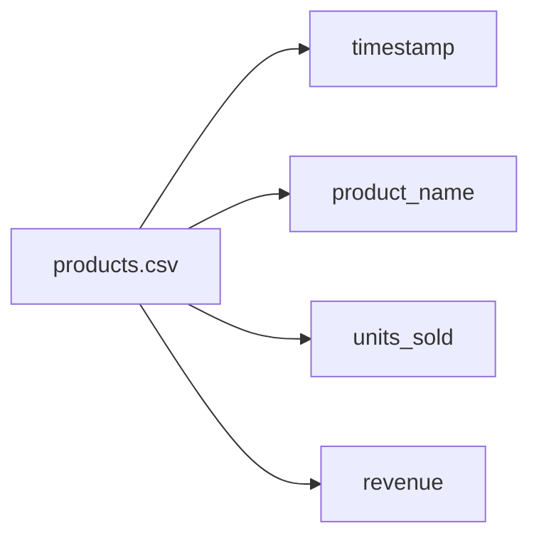
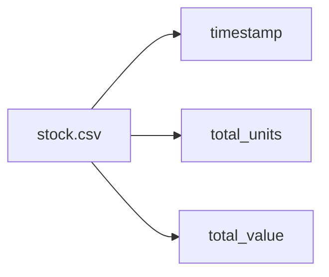

# Sales Analysis CSV Export Implementation Plan

## Overview
This document outlines the plan for implementing CSV exports of periodic sales analysis data. The system will save different aspects of the analysis in separate CSV files with timestamps for historical tracking and comparison.

## Storage Structure



## Data Structure

### Revenue History (revenue.csv)


### Store History (stores.csv)


### Product History (products.csv)


### Stock History (stock.csv)


## Implementation Plan

### 1. Directory Structure
- Create a new `historical_data` directory
- Create subdirectories for each type of data:
  - `revenue_history/`
  - `store_history/`
  - `product_history/`
  - `stock_history/`

### 2. New Module Creation
Create a new Python module `csv_exporter.py` with the following components:
- Directory creation and management functions
- CSV export functions for each data type
- Timestamp handling utilities
- Error handling and logging integration

### 3. Code Changes Required

#### a. Directory Management
```python
def create_export_directories():
    # Create main historical data directory
    # Create subdirectories for each data type
    # Ensure proper permissions
```

#### b. CSV Export Functions
```python
def export_revenue_data(timestamp, total_revenue, total_employees):
    # Create CSV with revenue data

def export_store_data(timestamp, store_data):
    # Create CSV with store performance data

def export_product_data(timestamp, product_data):
    # Create CSV with product sales data

def export_stock_data(timestamp, stock_data):
    # Create CSV with stock information
```

#### c. Integration Points
- Modify `analyze_data()` function to call export functions after analysis
- Add error handling for export operations
- Update logging to include export status

### 4. Testing Considerations
- Test directory creation
- Validate CSV format and data integrity
- Verify timestamp handling
- Check file permissions
- Test error handling

### 5. Future Enhancements
- Data visualization capabilities
- Historical trend analysis
- Automated cleanup of old data
- Compression of historical files
- Backup integration

## Implementation Steps

1. Create new `csv_exporter.py` module
2. Implement directory structure creation
3. Develop CSV export functions
4. Modify main analysis code to include exports
5. Add error handling and logging
6. Test implementation
7. Deploy changes
8. Monitor system performance

## Success Criteria
- CSV files are created successfully after each analysis
- Data is properly formatted and includes timestamps
- Directory structure is maintained
- Error handling prevents data corruption
- Logging provides clear visibility into export operations